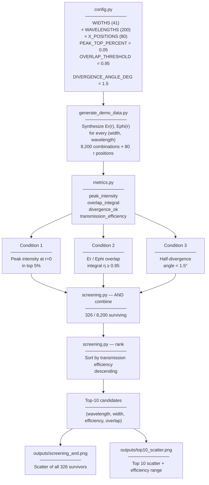

# waveguide-screening — Pipeline 流程說明

## 1. 流程圖（Mermaid）

---

## 2. 逐步說明

### Step 1 — 設定參數空間
- 寬度網格：0.10 ~ 0.90，步長 0.02，共 **41 個 widths**
- 波長網格：0.714 ~ 1.666，共 **200 個 wavelengths**
- 偵測位置：0 ~ 39.5，共 **80 個 r positions**
- 每個 (width, wavelength) 組合 → 80 個 r 位置上的能量值
- 總共 **8,200 個候選組合**

### Step 2 — 合成資料
針對每個 (width, wavelength)：
- 用 Gaussian envelope × radial ringing 構造 |Er|²(r)
- 在參數空間中設計一個 sweet spot（width ≈ 0.5, wavelength ≈ 1.0）
- 越靠近 sweet spot：peak 越高、發散越小
- |Ephi|² = |Er|² × (1 + 隨機擾動)，約 30% 的組合會被加入較大擾動而打破對稱

### Step 3 — 套用三個物理篩選條件

| Condition | 物理意義 | 數學表達 | 對應碩論意涵 |
|---|---|---|---|
| **C1** Peak intensity | 中心軸能量夠強 | x_0 ≥ top 5% threshold | 光仍集中在傳輸方向 |
| **C2** Overlap integral | Er/Ephi 場分布對稱 | η = (Σ Er·Ephi)² / (Σ Er² · Σ Ephi²) ≥ 0.95 | 模態純度高 |
| **C3** Divergence | 半擴散角夠小 | x_target < x_0 / e² | 光束發散低 |

### Step 4 — AND 組合
- 三個條件同時成立的組合才保留
- 在預設 seed 下：8,200 → **326 個 candidate**

### Step 5 — 計算傳輸效率
- 對每個 surviving candidate
- transmission_efficiency = 偵測平面總能量 / 光源平面總能量
- 結果範圍：0.128 ~ 0.137（demo data 設計與原研究 5–23% 同數量級）

### Step 6 — 排序與輸出
- 依效率降序排列
- 取 Top-10
- 印出表格 + 兩張散點圖

---

## 3. 輸入 / 輸出

### Inputs
| 項目 | 來源 |
|---|---|
| 參數網格 | `config.py` 寫死 |
| 物理閾值 | `config.py` 寫死 |
| 場分布 (Er, Ephi) | `generate_demo_data.py` 合成 |
| 光源強度 | `generate_demo_data.py` 合成 |

### Outputs
| 項目 | 形式 | 位置 |
|---|---|---|
| Top-10 排行表 | terminal | stdout |
| 三條件 AND 散點圖 | PNG | `outputs/screening_and.png` |
| Top-10 散點圖 | PNG | `outputs/top10_scatter.png` |

---

## 4. 與原 MATLAB 版本對應

| 原 MATLAB 行為 | Python 對應 |
|---|---|
| 81 個 `.wmn` 檔讀取 | 由 `build_dataset()` 合成資料取代 |
| `Er_data(:,3) >= top_5%` | `mark_peak_top_percent` |
| 迴圈計算 overlap_integral | `mark_overlap_passing`（向量化） |
| `Er_data(:,18) < ... /exp(2)`（硬編碼欄位） | `mark_divergence_passing` + `x_index_for_angle`（從角度反算） |
| `condition1 & condition2 & condition3` | `combine_and(m1, m2, m3)` |
| 讀光源 + 插值 | source 強度直接合成 80 點，省略插值 |
| 多個 `figure; plot(...)` | `plot_scatter` × 2 |

---

## 5. 為什麼用 demo data（NotebookLM 重點）

- 原始 simulation 來自專用光學/電磁模擬工具（FullWAVE 類），原始檔案未公開
- 公開版用 **physics-inspired synthesis** 重建分析流程
- 目的：**展示方法與篩選邏輯，不重現論文結果**
- demo data 在參數空間內刻意設計 sweet spot，讓 pipeline 能展示出「真的能找出對的候選」
